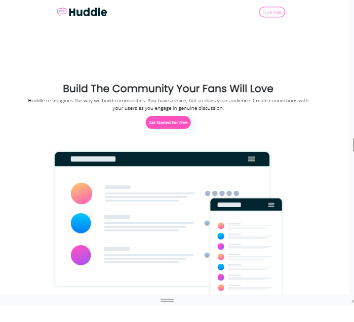

# Frontend Mentor - Huddle landing page with curved sections solution

This is a solution to the [Huddle landing page with curved sections challenge on Frontend Mentor](https://www.frontendmentor.io/challenges/huddle-landing-page-with-curved-sections-5ca5ecd01e82137ec91a50f2). Frontend Mentor challenges help you improve your coding skills by building realistic projects. 

## Table of contents

- [Overview](#overview)
  - [The challenge](#the-challenge)
  - [Screenshot](#screenshot)
  - [Links](#links)
- [My process](#my-process)
  - [Built with](#built-with)
  - [What I learned](#what-i-learned)
  - [Continued development](#continued-development)
  - [Useful resources](#useful-resources)
- [Author](#author)

## Overview

### The challenge

Users should be able to:

- View the optimal layout for the site depending on their device's screen size
- See hover states for all interactive elements on the page

### Screenshot



### Links

- Solution URL: [Github](https://github.com/cmb347827/huddle-landing-page-with-curved-sections-master)
- Live Site URL: [Live Github](https://cmb347827.github.io/huddle-landing-page-with-curved-sections-master/)

## My process

### Built with

- Semantic HTML5 markup
- Bootstrap
- Sass/SCSS
- Javascript
- Mobile-first workflow


### What I learned

- I at first wrongly thought the idea was to apply all four section background images to the top section. Didn't notice the second section with also a lightblue background.
  So I was obviously struggling with that. I did manage with this old code for all four images applied to the top section.
  The html in first article section:
  ```
    <div class='background'>
		<div id='first' class="inner"></div>
        <div id='second' class="inner"></div>
        <div id='third' class="inner"></div>
        <div id='fourth' class="inner"></div>
    </div>
  ```
  The scss:
  ```
    .inner {
            width: 50%;
            height: 200px;
            box-sizing: border-box;
            border: 1px solid black;
            float: left; 
            &#first{
			   background: url(./images/bg-section-top-desktop-1.svg) top left/100% 100% no-repeat;
			   transform:translate(0,200%);
			}
            &#second{
			   background:url(./images/bg-section-top-desktop-2.svg) top left/100% 100% no-repeat;
			   transform:translate(0,200%);
			}
            &#third{
			   background:url(./images/bg-section-bottom-desktop-1.svg) top left/100% 100% no-repeat;
			   transform:translate(0,200%);
			}
            &#fourth{
			   background:url(./images/bg-section-bottom-desktop-2.svg) top left/100% 100% no-repeat;
			   transform:translate(0,200%);
			}			
     }
  ```
  Based on the stackoverflow post in first link, as I saw no way how to apply all four images to the section without overlap using just the regular background property.
- I did manage to eventually to figure out how to add the correct background images to the top and bottom sections.
  It took a long time because of margins top/bottom issues but I could solve some issues by adding an extra div to the container_4 footer and to the container_3 background sections (first div). 
- I also re-used code from my fylo-dark-theme-landing-page-master project for the email validation.
- I also dealt with wrongful placement of elements using justify-content-between, or at least it didn't look as expected because the elements had transform applied to them.
  
### Continued development

- Daily tutorials and projects in HTML5, CSS3, Javascript, Bootstrap, Sass/SCSS, some jQuery. For now, in time I will go re-learn React ect.

### useful-resources

[Split a div into four equal parts](https://stackoverflow.com/questions/40233044/split-a-div-into-four-equal-div)


## Author

- Website - [One of my latest codepens](https://codepen.io/cynthiab72/pen/oNybYON)
- Frontend Mentor - [@cmb347827](https://www.frontendmentor.io/profile/cmb347827)
